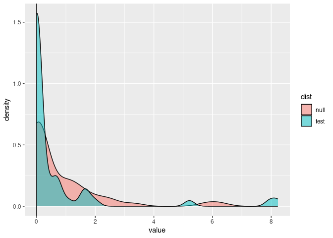

<!-- README.md is generated from README.Rmd. Please edit that file -->

[](https://travis-ci.org/cboettig/pmc)
[](https://coveralls.io/github/cboettig/pmc)
[](https://cran.r-project.org/package=pmc)
[](https://zenodo.org/badge/latestdoi/1822987)

This is a lightweight implementation of my `pmc` package focusing on
what I think are the more common use cases (e.g. it will no longer
support comparisons of a `geiger` model against an `ouch` model).
Further, it does not cover many of the newer model fitting that have
been implemented since `pmc` was first released.

The goal of this release is mostly to provide compatibility with current
versions of `geiger`.

Getting started
---------------

Install the package:

``` r
library("devtools")
install_github("cboettig/pmc")
```

A trivial example with data simulated from the `lambda` model.

``` r
library("pmc")
library("geiger")
#> Loading required package: ape
phy <- sim.bdtree(n=10)
dat <- sim.char(rescale(phy, "lambda", .5), 1)[,1,]
out <- pmc(phy, dat, "BM", "lambda", nboot = 50)
#> Warning in fitContinuous(phy = tree, dat = data, model = model, ..., ncores = 1): 
#> Parameter estimates appear at bounds:
#>  lambda
```

Plot the results:

``` r
dists <- data.frame(null = out$null, test = out$test)
library("ggplot2")
library("tidyr")
library("dplyr")
#> 
#> Attaching package: 'dplyr'
#> The following objects are masked from 'package:stats':
#> 
#>     filter, lag
#> The following objects are masked from 'package:base':
#> 
#>     intersect, setdiff, setequal, union
dists %>% 
  gather(dist, value) %>%
  ggplot(aes(value, fill = dist)) + 
  geom_density(alpha = 0.5) + 
  geom_vline(xintercept = out$lr)
```



Citation
--------

Carl Boettiger, Graham Coop, Peter Ralph (2012) Is your phylogeny
informative? Measuring the power of comparative methods, Evolution 66
(7) 2240-51.
<a href="https://doi.org/10.1111/j.1558-5646.2011.01574.x" class="uri">https://doi.org/10.1111/j.1558-5646.2011.01574.x</a>
