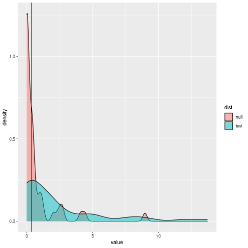
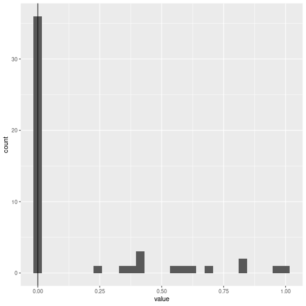
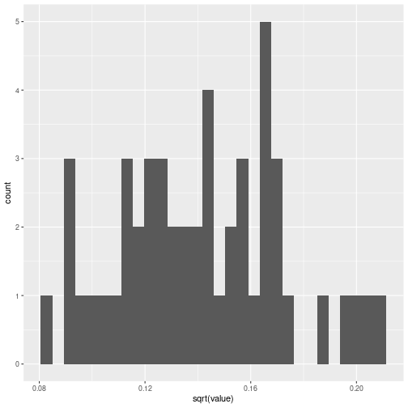
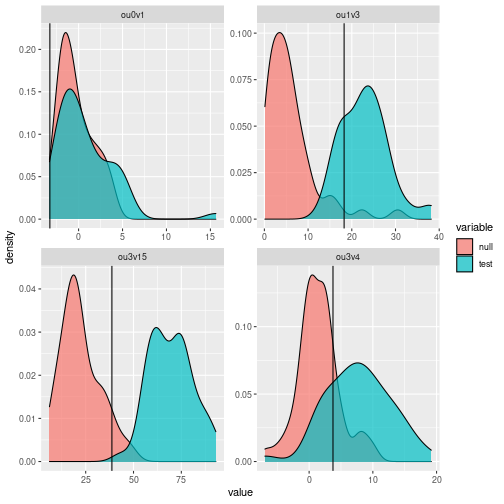

**Beta, use with caution!**

This is a lightweight implementation of my `pmc` package focusing on what I think are the more common use cases (e.g. it will no longer support comparisons of a `geiger` model against an `ouch` model). Further, it does not cover many of the newer model fitting that have been implemented since `pmc` was first released. 

The goal of this release is mostly to provide compatibility with current versions of `geiger`.

## Getting started


```r
knitr::opts_chunk$set(comment=NA, warning=FALSE, message=FALSE)
```

Install the package:


```r
library("devtools")
install_github("cboettig/pmc2")
```


```r
library("pmc")
library("geiger")
library("ouch")
library("ggplot2")
library("tidyr")
library("dplyr")
library("gridExtra")
```


A trivial example with data simulated from the `lambda` model. 


```r
cores <- 1 # parallel cores available
nboot <- 50 # too small, but vignette gotta build faster
phy <- sim.bdtree(n=10)
dat <- sim.char(rescale(phy, "lambda", .5), 1)[,1,]
out <- pmc(phy, dat, "BM", "lambda", nboot = nboot, mc.cores = cores)
```

Plot the results:


```r
dists <- data.frame(null = out$null, test = out$test)
dists %>% 
  gather(dist, value) %>%
  ggplot(aes(value, fill = dist)) + 
  geom_density(alpha = 0.5) + 
  geom_vline(xintercept = out$lr)
```




## Finches Examples

The first set of examples uses the finches data and geiger functions~\citep{Harmon2008} to look at uncertainty in parameter estimates using the pmc method.  We start off by loading the required libraries 


```r
data(geospiza)
bm_v_lambda <- pmc(geospiza$phy, geospiza$dat[, "wingL"],
  "BM", "lambda", nboot = nboot, mc.cores = cores) 
```

Currently the output will only run for a single trait at a time, for efficient memory usage.  Here we specify the wing length trait. 


We can analyze the parameter distributions as presented in the manuscript.  
For instance, we can look at a histogram of values of lambda obtained from the different simulations. 
Because the pmc approach runs four different fits: 

\begin{itemize} 
\item ``AA'' fitting model A on data obtained by simulations from model A,
\item ``BA'' fitting model B on the data simulated from model A
\item ``AB'' fitting model A on simulations from B
\item ``BB'' fitting B on simulations from B
\end{itemize}

there are actually 4 different parameter distributions we can use.  
The comparisons ``AA'' and ``BB'' are the typical way one would bootstrap the model fits.
All of these combinations are returned in the data set \verb|par_dists| which is one of the 
items in the list returned by pmc (which we have named \verb|bm_v_lambda| above).  
Subsetting is a good way to get the parameter of interest, lambda, for the comparison of interest, BB.
(Note that for comparisons AA and AB, which fit model Brownian motion, there is of course no parameter lambda).


```r
lambdas <- bm_v_lambda$par_dists %>% filter(comparison=="BB", parameter=="lambda") 
```

The returned list from pmc also stores the two models it fit to the original data, inder the names A and B. 
We can use this to extract the value of lambda estimated on model B from the raw data:


```r
est <- coef(bm_v_lambda[["B"]])[["lambda"]]
```


```r
ggplot(lambdas) + geom_histogram(aes(value)) +
      geom_vline(xintercept=est)
```



Note that the ability to estimate lambda is very poor, with most simulations returning an estimate of almost zero despite the true value used in the simulations being \Sexpr{est}.  Estimating the sigma parameter is somewhat more reliable, even on this small tree:


```r
bm_v_lambda$par_dists %>% filter(comparison=="BB", parameter=="sigsq") %>% 
ggplot() + geom_histogram(aes(sqrt(value))) 
```



<!-- 

We can also query the confidence intervals directly from the estimates returned by the pmc function.  Using the lambda value we already extracted, we can get confidence intervals, 


```r
reshape2::cast(lambdas, comparison ~ parameter, function(x)
     quantile(x, c(.05, .95)), value=c("lower", "upper"))
```

-->


## Anoles example

Next we consider the examples re-analyzing the Anoles data from @Butler2004, using methods from the `ouch` package.


```r
data(anoles)
tree <- with(anoles, ouchtree(node, ancestor, time / max(time), species))

ou3v4 <- pmc(tree, log(anoles["size"]), modelA = "hansen", modelB = "hansen", 
             optionsA = list(regimes = anoles["OU.LP"]), 
             optionsB = list(regimes = anoles["OU.4"]),
             nboot = nboot, sqrt.alpha = 1, sigma = 1, mc.cores = cores)

ou3v15 <- pmc(tree, log(anoles["size"]), "hansen", "hansen", 
             list(regimes = anoles["OU.LP"]), 
             list(regimes = anoles["OU.15"]),
             nboot = nboot, sqrt.alpha = 1, sigma = 1, mc.cores = cores)
                   
ou1v3 <- pmc(tree, log(anoles["size"]), "hansen", "hansen", 
             list(regimes = anoles["OU.1"]), 
             list(regimes = anoles["OU.LP"]),
             nboot = nboot, sqrt.alpha = 1, sigma = 1, mc.cores = cores)
 
ou0v1 <- pmc(tree, log(anoles["size"]), "brown", "hansen", 
             list(), 
             list(regimes = anoles["OU.1"], sqrt.alpha = 1, sigma = 1),
             nboot = nboot, mc.cores = cores)
```


```r
results <- bind_rows(
  data.frame(comparison = "ou3v4", null = ou3v4$null, test = ou3v4$test, lr = ou3v4$lr),
  data.frame(comparison = "ou3v15", null = ou3v15$null, test = ou3v15$test, lr = ou3v15$lr),
  data.frame(comparison = "ou1v3", null = ou1v3$null, test = ou1v3$test, lr = ou1v3$lr),
  data.frame(comparison = "ou0v1", null = ou0v1$null, test = ou0v1$test, lr = ou0v1$lr)) %>%
gather(variable, value, - comparison, - lr) 
ggplot(results) + 
  geom_density(aes(value, fill = variable), alpha=0.7) + 
  geom_vline(aes(xintercept=lr)) +
  facet_wrap(~ comparison, scales="free")
```




<!--

```r
a <- plot(ou3v4, A = "OU.3", B ="OU.4") + labs(title = "OU.3 vs OU.4") 
b <- plot(ou3v15, A = "OU.3", B ="OU.15") + labs(title = "OU.3 vs OU.15") 
c <- plot(ou1v3, A = "OU.1", B = "OU.3")  + labs(title = "OU.1 vs OU.3")
d <- plot(ou0v1, A = "BM", B = "OU.1")  + labs(title = "BM vs OU.1")
grid.arrange(a, b, c, d, ncol = 2)
```
-->


## Citation

Carl Boettiger, Graham Coop, Peter Ralph (2012) Is your phylogeny informative? Measuring the power of comparative methods, Evolution 66 (7) 2240-51. 

